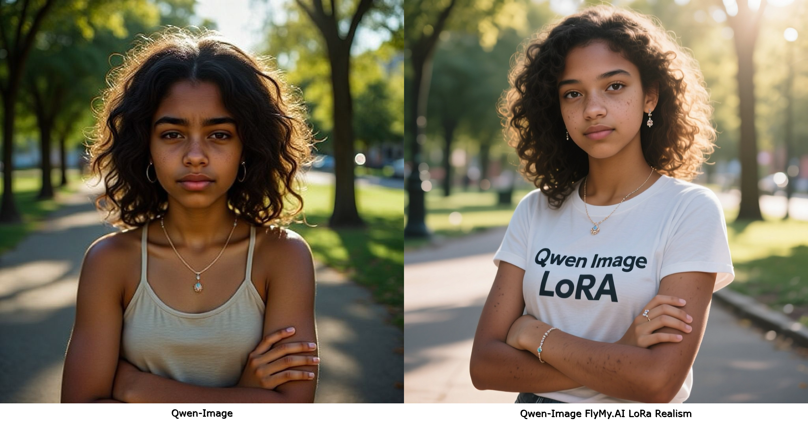
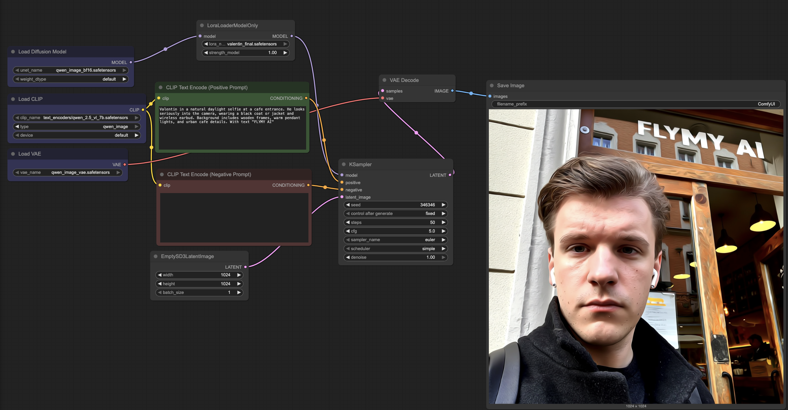

# LoRA Training for Qwen-Image


An open-source implementation for training LoRA (Low-Rank Adaptation) layers for Qwen/Qwen-Image models by [FlyMy.AI](https://flymy.ai).

<p align="center">
  
</p>

## 🌟 About FlyMy.AI

Agentic Infra for GenAI. FlyMy.AI is a B2B infrastructure for building and running GenAI Media agents.


**🔗 Useful Links:**
- 🌐 [Official Website](https://flymy.ai)
- 📚 [Documentation](https://docs.flymy.ai/intro)
- 💬 [Discord Community](https://discord.com/invite/t6hPBpSebw)
- 🤗 [Pre-trained LoRA Model](https://huggingface.co/flymy-ai/qwen-image-realism-lora)
- 🐦 [X (Twitter)](https://x.com/flymyai)
- 💼 [LinkedIn](https://linkedin.com/company/flymyai)
- 📺 [YouTube](https://youtube.com/@flymyai)
- 📸 [Instagram](https://www.instagram.com/flymy_ai)

## 🚀 Features

- LoRA-based fine-tuning for efficient training
- Compatible with Hugging Face `diffusers`
- Easy configuration via YAML
- Open-source implementation for LoRA training

## 📅 Updates

**08.08.2025**
- ✅ Added comprehensive dataset preparation instructions
- ✅ Added automatic checkpoint saving in ComfyUI compatible format
- ✅ Added dataset validation script (`utils/validate_dataset.py`)
- ✅ Freeze model weights during training

## ⚠️ Project Status

**🚧 Under Development:** We are actively working on improving the code and adding test coverage. The project is in the refinement stage but ready for use.

**📋 Development Plans:**
- ✅ Basic code is working
- ✅ Training functionality implemented
- 🔄 Performance optimization in progress
- 🔜 Test coverage coming soon

---

## 📦 Installation

1. Clone the repository and navigate into it:
   ```bash
   git clone https://github.com/FlyMyAI/qwen-image-lora-trainer
   cd qwen-image-lora-trainer
   ```

2. Install required packages:
   ```bash
   pip install -r requirements.txt
   ```

3. Install the latest `diffusers` from GitHub:
   ```bash
   pip install git+https://github.com/huggingface/diffusers
   ```

4. Download pre-trained LoRA weights (optional):
   ```bash
   # Clone the repository with LoRA weights
   git clone https://huggingface.co/flymy-ai/qwen-image-realism-lora
   
   # Or download specific files
   wget https://huggingface.co/flymy-ai/qwen-image-realism-lora/resolve/main/flymy_realism.safetensors
   ```

---

## 📁 Data Preparation

### Dataset Structure

The training data should follow the same format as Flux LoRA training, where each image has a corresponding text file with the same name:

```
dataset/
├── img1.png
├── img1.txt
├── img2.jpg
├── img2.txt
├── img3.png
├── img3.txt
└── ...
```

### Data Format Requirements

1. **Images**: Support common formats (PNG, JPG, JPEG, WEBP)
2. **Text files**: Plain text files containing image descriptions
3. **File naming**: Each image must have a corresponding text file with the same base name

### Example Data Structure

```
my_training_data/
├── portrait_001.png
├── portrait_001.txt
├── landscape_042.jpg
├── landscape_042.txt
├── abstract_design.png
├── abstract_design.txt
└── style_reference.jpg
└── style_reference.txt
```

### Text File Content Examples

**portrait_001.txt:**
```
A realistic portrait of a young woman with brown hair, natural lighting, professional photography style
```

**landscape_042.txt:**
```
Mountain landscape at sunset, dramatic clouds, golden hour lighting, wide angle view
```

**abstract_design.txt:**
```
Modern abstract art with geometric shapes, vibrant colors, minimalist composition
```

### Data Preparation Tips

1. **Image Quality**: Use high-resolution images (recommended 1024x1024 or higher)
2. **Description Quality**: Write detailed, accurate descriptions of your images
3. **Consistency**: Maintain consistent style and quality across your dataset
4. **Dataset Size**: For good results, use at least 10-50 image-text pairs
5. **Trigger Words**: If training on a specific concept, include consistent trigger words in descriptions
6. **Auto-generate descriptions**: You can generate image descriptions automatically using [Florence-2](https://huggingface.co/spaces/gokaygokay/Florence-2)

### Quick Data Validation

You can verify your data structure using the included validation utility:

```bash
python utils/validate_dataset.py --path path/to/your/dataset
```

This will check that:
- Each image has a corresponding text file
- All files follow the correct naming convention
- Report any missing files or inconsistencies

---

## 🏁 Start Training

To begin training with your configuration file (e.g., `train_lora.yaml`), run:

```bash
accelerate launch train.py --config ./train_configs/train_lora.yaml
```

Make sure `train_lora.yaml` is correctly set up with paths to your dataset, model, output directory, and other parameters.
## 🧪 Usage

---
### 🔧 Initialization

```python
from diffusers import DiffusionPipeline
import torch

model_name = "Qwen/Qwen-Image"

# Load the pipeline
if torch.cuda.is_available():
    torch_dtype = torch.bfloat16
    device = "cuda"
else:
    torch_dtype = torch.float32
    device = "cpu"

pipe = DiffusionPipeline.from_pretrained(model_name, torch_dtype=torch_dtype)
pipe = pipe.to(device)
```

### 🔌 Load LoRA Weights

```python
# Load LoRA weights
pipe.load_lora_weights('flymy-ai/qwen-image-realism-lora', adapter_name="lora")
```

### 🎨 Generate Image with lora trained on person
You can find LoRA weights [here](https://huggingface.co/flymy-ai/qwen-image-realism-lora)

No trigger word required
```python
prompt = '''Super Realism portrait of a teenager woman of African descent, serene calmness, arms crossed, illuminated by dramatic studio lighting, sunlit park in the background, adorned with delicate jewelry, three-quarter view, sun-kissed skin with natural imperfections, loose shoulder-length curls, slightly squinting eyes, environmental street portrait with text "FLYMY AI" on t-shirt.'''
negative_prompt =  " "
image = pipe(
    prompt=prompt,
    negative_prompt=negative_prompt,
    width=1024,
    height=1024,
    num_inference_steps=50,
    true_cfg_scale=5,
    generator=torch.Generator(device="cuda").manual_seed(346346)
)

# Display the image (in Jupyter or save to file)
image.show()
# or
image.save("output.png")
```

### 🖼️ Sample Output



---

## 🎛️ Using with ComfyUI

We provide a ready-to-use ComfyUI workflow that works with our trained LoRA models. Follow these steps to set up and use the workflow:

### Setup Instructions

1. **Download the latest ComfyUI**:
   - Visit the [ComfyUI GitHub repository](https://github.com/comfyanonymous/ComfyUI)
   - Clone or download the latest version

2. **Install ComfyUI**:
   - Follow the installation instructions from the [ComfyUI repository](https://github.com/comfyanonymous/ComfyUI?tab=readme-ov-file#installing)
   - Make sure all dependencies are properly installed

3. **Download Qwen-Image model weights**:
   - Go to [Qwen-Image ComfyUI weights](https://huggingface.co/Comfy-Org/Qwen-Image_ComfyUI/tree/main)
   - Download all the model files

4. **Place Qwen-Image weights in ComfyUI**:
   - Copy the downloaded Qwen-Image model files to the appropriate folders in `ComfyUI/models/`
   - Follow the folder structure as specified in the model repository

5. **Download our pre-trained LoRA weights**:
   - Visit [flymy-ai/qwen-image-lora](https://huggingface.co/flymy-ai/qwen-image-lora)
   - Download the LoRA `.safetensors` files

6. **Place LoRA weights in ComfyUI**:
   - Copy the LoRA file `flymy-ai/qwen-image-lora/pytorch_lora_weights.safetensors` to `ComfyUI/models/loras/`

7. **Load the workflow**:
   - Open ComfyUI in your browser
   - Load the workflow file `qwen_image_lora_example.json` located in this repository
   - The workflow is pre-configured to work with our LoRA models

### Workflow Features

- ✅ Pre-configured for Qwen-Image + LoRA inference
- ✅ Optimized settings for best quality output
- ✅ Easy prompt and parameter adjustment
- ✅ Compatible with all our trained LoRA models

The ComfyUI workflow provides a user-friendly interface for generating images with our trained LoRA models without needing to write Python code.

### 🖼️ Workflow Screenshot



---

## 🤝 Support

If you have questions or suggestions, join our community:
- 🌐 [FlyMy.AI](https://flymy.ai)
- 💬 [Discord Community](https://discord.com/invite/t6hPBpSebw)
- 🐦 [Follow us on X](https://x.com/flymyai)
- 💼 [Connect on LinkedIn](https://linkedin.com/company/flymyai)
- 📧 [Support](mailto:support@flymy.ai)

**⭐ Don't forget to star the repository if you like it!**
